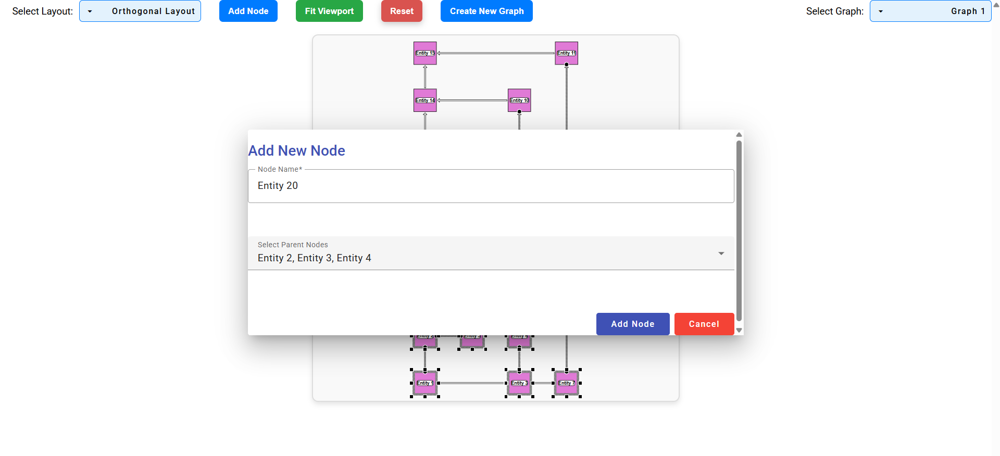

YFilesPracticeProject

Features

All Layouts

Displays all available graph layouts for visualization.

Circular Layout

Arranges nodes in a circular manner, making relationships easier to observe.

Hierarchic Layout

Structures nodes hierarchically, useful for tree-like data visualization.

Add Node With Parents

Allows adding a node along with its parent nodes dynamically.

Delete Node

Removes selected nodes from the graph.

How to Run

Start the API

Open PowerShell and navigate to the api directory:

cd api

Run the .NET backend:

dotnet run

Start the Frontend

In another PowerShell window, navigate to the client directory:

cd client

Run the frontend application:

ng serve

Open a browser and go to http://localhost:4200/ to use the application.

